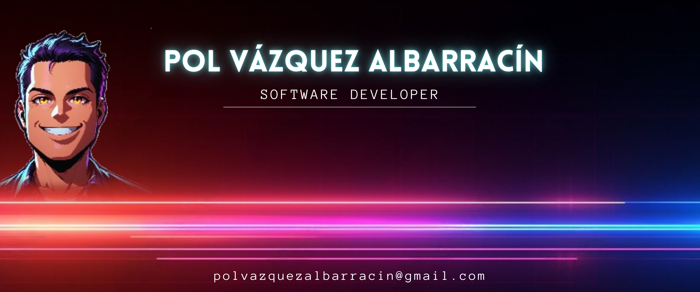

# 👨‍💻 Hello! I'm Pol Vázquez Albarracín - Software Developer  

---

## 🤖 About Me  

Hi, I'm not a robot (although my code might suggest otherwise)!  
I'm a developer passionate about technology. I enjoy working on backend and frontend projects, always with a focus on user experience.  

💡 **Professional goal:** Make my code cleaner than my desk (a significant challenge).  
⚙️ **What motivates me:** Solving complex problems and maintaining constant learning in an ever-evolving technological world.  
⚡ In my free time, I work on my portfolio and test technologies that will probably make me question my life choices.

---

## 🌟 Technical Skills  

### 🛠️ Backend  
-   
-   
-   
-   
-   
-   

### 🌐 Frontend  
-   
-   
-   
-   
-   

### 🗄️ Databases  
-   
-   
-   
-   

### ☁️ DevOps and Methodologies  
-   
- Agile (Scrum, Kanban)  

### 📋 Architectures and Frameworks  
- MVC, MVVM, N Layers, Microservices  
-   
- LINQ  

---

## 🚀 Featured Projects  

📂 **Frontend**:  
- **[PolVazquezTechApp](https://github.com/PolVazquez/PolVazquezTechApp)**: Web application built with **Blazor WebAssembly** to showcase my projects and skills.

📂 **Backend**:  
- **[PolVazquezTech.Backend.PHP](https://github.com/PolVazquez/PolVazquezTech.Backend.PHP)**: Backend in **PHP (Symfony)** optimized for solid performance.  
- **[PolVazquezTech.Backend.DotNet](https://github.com/PolVazquez/PolVazquezTech.Backend.DotNet)**: Modern **.NET Core** API, designed under microservices principles.  
- **[PolVazquezTech.Backend.Python](https://github.com/PolVazquez/PolVazquezTech.Backend.Python)**: **Python** RESTful API, perfect for high scalability scenarios.  

---

## 🔧 Tools I Use  

| **Area**         | **Tools**                                  |
|------------------|--------------------------------------------|
| **IDE**          | Visual Studio Code, Visual Studio          |
| **Version Control** | Git, GitHub                             |
| **Collaboration** | Azure DevOps                              |

---

## 🌐 Connect with Me  

- **LinkedIn**: [Pol Vázquez Albarracín](https://www.linkedin.com/in/polv%C3%A1zquezalbarrac%C3%ADn/)  
- **GitHub**: [@PolVazquez](https://github.com/PolVazquez)  
- **Email**: polvazquezalbarracin@gmail.com  

---

⭐ **Explore my repositories and let's collaborate to build something amazing. Code is always better in a team.**  

### ⚙️ &nbsp;GitHub Analytics

